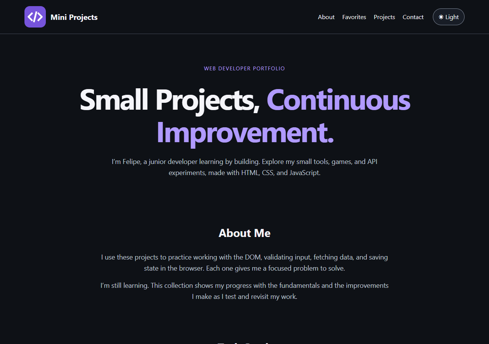
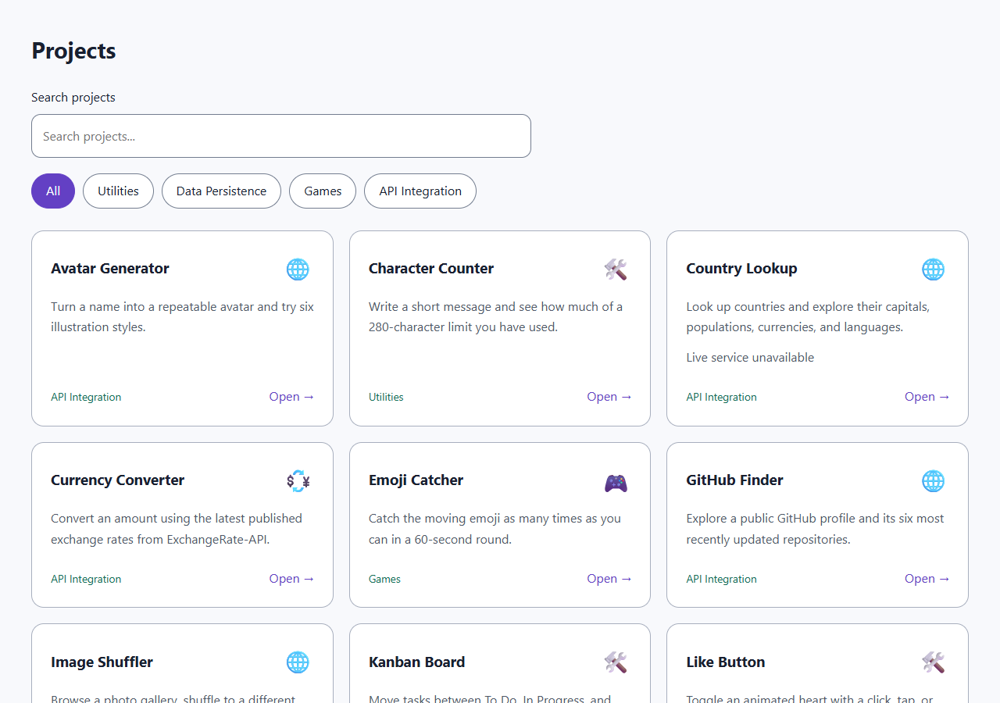
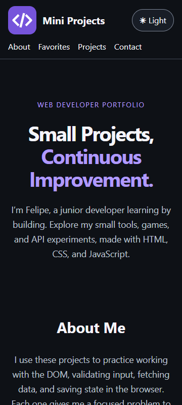
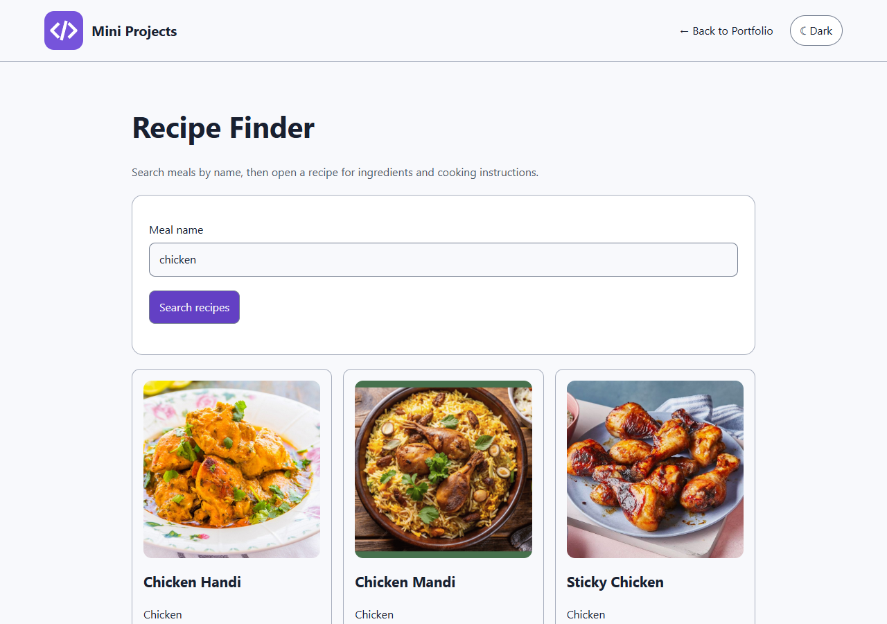

# Mini Projects Portfolio

I’m Felipe, a junior developer practicing HTML, CSS, and vanilla JavaScript through small tools, games, and API experiments. This portfolio brings **25 projects** into one searchable catalog. There is no framework, application backend, account system, or build step.









## Run locally

From the repository folder, with Node.js installed:

```powershell
cd "D:\Software Development\Mini-Projects"
node tools/serve.cjs
```

Open [the local portfolio](http://127.0.0.1:4173/). Use [the repository subpath](http://127.0.0.1:4173/Mini-Projects/) to check GitHub Pages-style paths. Stop the server with Ctrl+C. The small Node script serves static files for development only. Alternatively use VS Code Live Server or `python -m http.server 4173`. Do not open `index.html` with `file://`: the catalog fetch needs HTTP. Clipboard operations need localhost or HTTPS.

## What is included

- Curated favorites come only from the `favorite` boolean in `projects.json`; visitors do not save favorites.
- Search and category filters combine. Favorites remain independent of both.
- Shared navigation and a persisted light/dark theme work on each project page.
- API pages have loading, empty and failure feedback. Requests time out, queries are encoded, and displayed external text uses DOM text nodes.
- Original examples remain in `Projects Examples` for reference.

| Project                                                                            | Category         | Availability                                        |
| ---------------------------------------------------------------------------------- | ---------------- | --------------------------------------------------- |
| [Avatar Generator](Projects/api-integration/avatar-generator/index.html)           | API Integration  | Verified with live service and controlled responses |
| [Character Counter](Projects/utilities/character-counter/index.html)               | Utilities        | Verified in browser                                 |
| [Country Lookup](Projects/api-integration/country-lookup/index.html)               | API Integration  | Live service unavailable                            |
| [Currency Converter](Projects/api-integration/currency-converter/index.html)       | API Integration  | Verified with live service and controlled responses |
| [Emoji Catcher](Projects/games/emoji-catcher/index.html)                           | Games            | Verified in browser                                 |
| [GitHub Finder](Projects/api-integration/github-finder/index.html)                 | API Integration  | Verified with live service and controlled responses |
| [Image Shuffler](Projects/api-integration/image-shuffler/index.html)               | API Integration  | Verified with live service and controlled responses |
| [Kanban Board](Projects/utilities/kanban-board/index.html)                         | Utilities        | Verified in browser                                 |
| [Like Button](Projects/utilities/like-button/index.html)                           | Utilities        | Verified in browser                                 |
| [Password Generator](Projects/utilities/password-generator/index.html)             | Utilities        | Verified in browser                                 |
| [Password Strength Meter](Projects/utilities/password-strength-meter/index.html)   | Utilities        | Verified in browser                                 |
| [Pokémon Viewer](Projects/api-integration/pokemon-viewer/index.html)               | API Integration  | Verified with live service and controlled responses |
| [QR Code Generator](Projects/utilities/qr-code-generator/index.html)               | Utilities        | Verified in browser                                 |
| [Quiz Game](Projects/games/quiz-game/index.html)                                   | Games            | Verified in browser                                 |
| [Quote Generator](Projects/utilities/quote-generator/index.html)                   | Utilities        | Verified in browser                                 |
| [Random Cat Images](Projects/api-integration/random-cat-images/index.html)         | API Integration  | Verified with live service and controlled responses |
| [Random Meal Generator](Projects/api-integration/random-meal-generator/index.html) | API Integration  | Verified with live service and controlled responses |
| [Random User](Projects/api-integration/random-user/index.html)                     | API Integration  | Verified with live service and controlled responses |
| [Recipe Finder](Projects/api-integration/recipe-finder/index.html)                 | API Integration  | Verified with live service and controlled responses |
| [Shape Clicker](Projects/games/shape-clicker/index.html)                           | Games            | Verified in browser                                 |
| [Stopwatch](Projects/utilities/stopwatch/index.html)                               | Utilities        | Verified in browser                                 |
| [Text Formatter](Projects/utilities/text-formatter/index.html)                     | Utilities        | Verified in browser                                 |
| [Tic Tac Toe](Projects/games/tic-tac-toe/index.html)                               | Games            | Verified in browser                                 |
| [Todo App](Projects/data-persistence/todo-app/index.html)                          | Data Persistence | Verified in browser                                 |
| [Word Counter](Projects/utilities/word-counter/index.html)                         | Utilities        | Verified in browser                                 |

Country Lookup is integrated, but its original REST Countries endpoint failed during live verification. Its controlled-response tests pass and the page discloses the blocker. See the [complete inventory, original functionality, dependencies and blocker](docs/INVENTORY.md).

## What each batch teaches

| Batch      | Projects                                                                         | Lesson                                                                                                                                             |
| ---------- | -------------------------------------------------------------------------------- | -------------------------------------------------------------------------------------------------------------------------------------------------- |
| Foundation | Todo, Tic Tac Toe, Password Generator, Currency Converter                        | Keep IDs unique, migrate stored data, own shared state inside shared code, and make randomness claims match the implementation.                    |
| 1          | Character Counter, Word Counter, Text Formatter, Stopwatch                       | Define counting rules, display text safely, toggle styles, and measure elapsed time rather than timer ticks.                                       |
| 2          | Like Button, Quote Generator, Password Strength Meter, Kanban, QR Code Generator | Use native controls, offer touch/keyboard alternatives, handle clipboard/library failures, and distinguish a checklist from a security assessment. |
| 3          | Quiz, Emoji Catcher, Shape Clicker                                               | Keep game state explicit, guard scoring, and cancel timers on reset or exit.                                                                       |
| 4          | Country Lookup, Pokémon Viewer, GitHub Finder                                    | Encode searches, validate responses, and distinguish no results from service failures.                                                             |
| 5          | Avatar Generator, Image Shuffler, Random Cat Images                              | Handle image loading, retain attribution, prevent overlapping requests, and recover pagination after errors.                                       |
| 6          | Random Meal Generator, Recipe Finder, Random User                                | Safely render nested API data, share a small meal renderer, and restore focus when returning from details.                                         |

## Organization

```text
index.html / style.css / script.js  Portfolio only
projects.json                      Catalog metadata and curated favorites
Shared/script.js                   Self-contained header, footer and theme
Shared/style.css                   Theme tokens and scoped shell styles
Shared/project.css                 Explicit opt-in mini-project baseline
Shared/project.js                  Small DOM, request, clipboard and meal helpers
Projects/<category>/<project>/     Integrated HTML, CSS and JavaScript
Projects Examples/                 Unmodified learning examples
Assets/                           Logo, favicon and licensed QR dependency
docs/                             Inventory, verification and screenshots
tools/                            Optional static server and browser checks
```

## Add another project

1. Create a lowercase, hyphenated folder such as `Projects/utilities/unit-converter` with `index.html`, `script.js` and `style.css`. Start from a small verified project such as Word Counter.
2. Keep the viewport meta tag, `project-page` body, `main#main.mini-app`, shared component containers, and relative `../../../Shared/` and `../../../Assets/` links. Scope distinctive CSS under `.mini-app`. Shared code must not depend on variables in a project script.
3. Add one entry to `projects.json`. Use an explicit index URL and a category from Utilities, Data Persistence, Games or API Integration:

```json
{
  "title": "Unit Converter",
  "description": "Convert between common length units.",
  "category": "Utilities",
  "emoji": "📏",
  "url": "Projects/utilities/unit-converter/index.html",
  "tags": ["units", "length"],
  "favorite": false
}
```

4. Test invalid input, reset/empty/error states, keyboard/touch controls and both themes. Use `textContent` for displayed text, validate external links, encode queries, and never ship private credentials.
5. Run `node tools/audit.cjs`, update this dated inventory, and repeat the [manual checklist](docs/VERIFICATION.md). No build command is needed.

## Static hosting

Serve the repository root as ordinary static files. All active asset and project links are relative or derived from the shared script URL, so deployment at a repository subpath works. `.nojekyll` is included. For GitHub Pages, choose the branch containing these changes and the root folder in repository Settings → Pages; this task does not publish or change repository settings.

No deployment URL for this finished revision has been verified. Add a Live Demo link after deploying and checking the public site; the previous demo placeholder has been removed.

## Verification and limitations

See [verification results and the short manual checklist](docs/VERIFICATION.md). Public APIs and hosted images may change, become rate limited, or go offline. Local utilities do not require those services. Task/theme persistence depends on browser storage availability; tasks remain usable in memory when writes are denied. The password meter is a learning checklist, and quoted author attributions are preserved rather than independently authenticated.

QRCode.js attribution and its local repair are documented in [Assets/vendor](Assets/vendor/README.md). Original examples retain their attribution. No repository-wide license file was present at inspection; third-party material retains its own terms.
